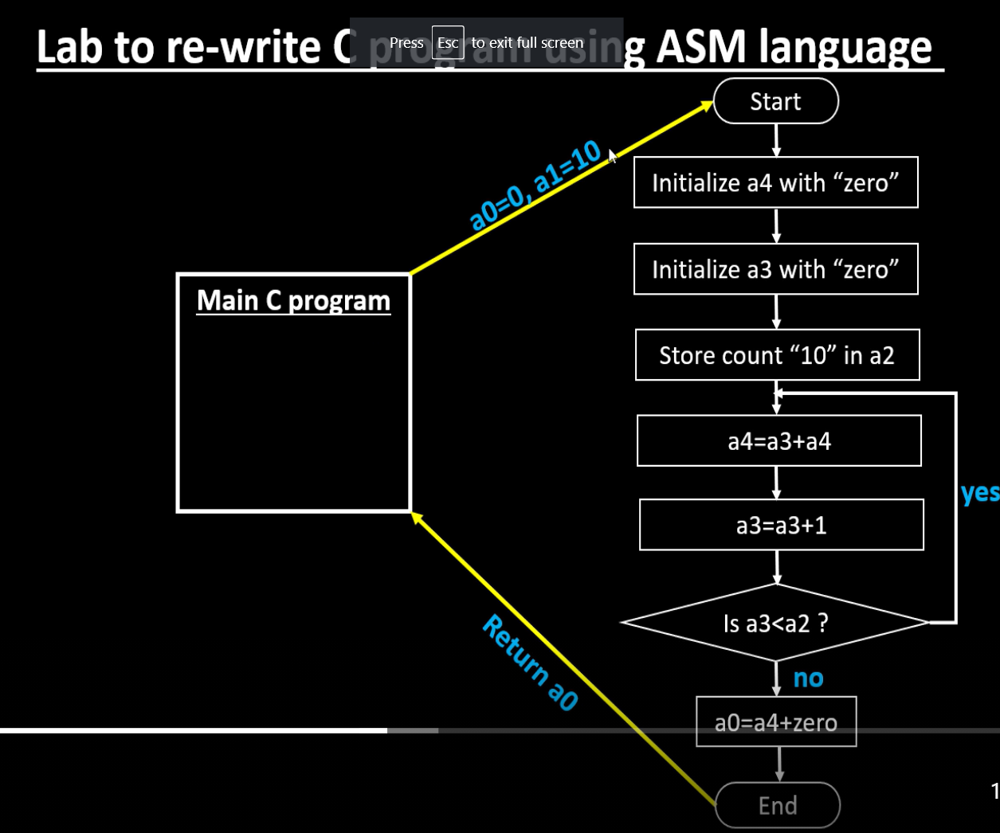
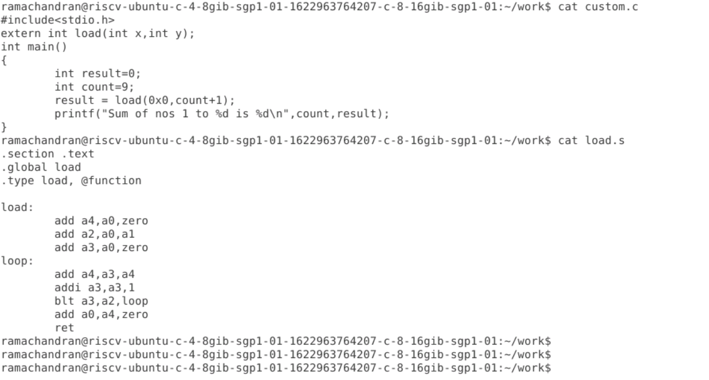
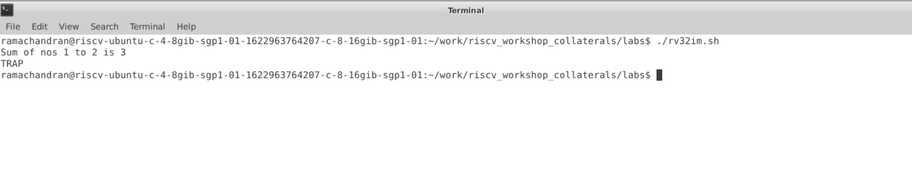

# Basic C program with function call simulation in RISCV simulator

<h2> Introduction </h2>

<p> The project focusses on testing a C program in a RISCV processor using the Verilog test bench. The processor is made using verilog code based on the RISCV ISA for 64 bit version. The RISCV used here is rv32im which can execute Basic integer instructions with pseudo and multiply extension instructions.</p>

<h2> Example Program </h2>

For this example we find the sum of numbers within a certian range say for example n = 2 in this case. The C code is as below.

```
//custom.c
#include<stdio.h>
extern int load(int x,int y);
int main()
{
	int result=0;
	int count=2;
	result = load(0x0,count+1);
	printf("Sum of nos 1 to %d is %d\n",count,result);
}

```
We add some assembly code for performing the logic of the program.

```
//load.S
.section .text
.global load
.type load, @function

load:
	add a4,a0,zero   //Setting a4 = 0
	add a2,a0,a1    // Store count=2 in a2 register and a1 is loaded with count=2 from main
	add a3,a0,zero   // Setting a3 = 0
loop:
	add a4,a3,a4      //a4 = a3 + a4
	addi a3,a3,1      // a3 = a3 + 1
	blt a3,a2,loop    // if (a3<a2) we branch to loop 
	add a0,a4,zero     //Setting a0 = a4
	ret

```

<p> Here the linking happens from C to ASM through the registers. The functions arguments are stored in a0 and a1, where a0 is loaded as 0x0 and a1 is loaded with count=2 value. Finally after execution of assembly code the ret statement stores the output to a0 from where the print statement uses the value and prints it. </p>

<h2> Algorithm </h2>



<h2> Execution </h2>

```
To compile
riscv64-unknown-elf-gcc -Ofast -mabi=lp64 -march=rv64i -o custom.o custom.c load.S

To run and see the output
spike pk custom.o

```

To run it on our RISCV core created using verilog

```
Place the custom.c and load.S file in the riscv_workshop_collaterals/labs
chmod 777 rv32im.sh
./rv32im.sh
```

<h2> Output </h2>




