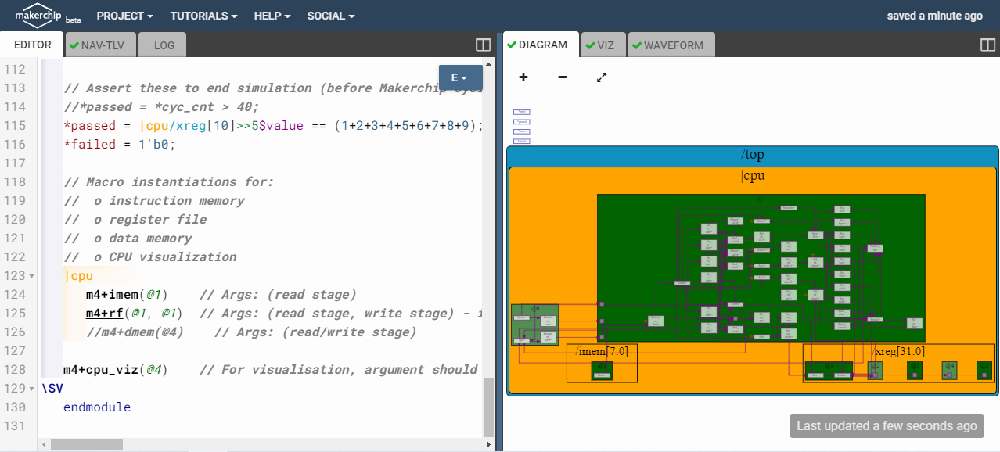

# RISC-V_MYTH_Workshop

For students of "Microprocessor for You in Thirty Hours" Workshop, offered by for VLSI System Design (VSD) and Redwood EDA, find here accompanying live info and links.

Refer to README at [stevehoover/RISC-V_MYTH_Workshop](https://github.com/stevehoover/RISC-V_MYTH_Workshop) for lab instructions.

Add your codes in the [calculator_solutions.tlv](calculator_solutions.tlv) and [risc-v_solutions.tlv](risc-v_solutions.tlv) files and **keep committing** to your repository after every lab.

# Day 3 Basic Calculator implementation

<h2> Introduction </h2>

<p> The project focusses on implementing a basic calculator with functions of add,subtract,multiply,divide,store and recall. The project is implemented using TL Verilog which encapsulates over the conventional verilog providing simplicity to the programmer. The project is divided into 6 six steps starting from implementing logic till pipelining to make it faster.</p>


<h2> Implementing Combinational Logic </h2>

<p> The calculator performs functions with 32 bits. The input to the calculator are provided in random between 0 to 15 to avoid any overflow or underflow. The particular operation is selected using op variable which is of 2 bits to select between 4 possible combinations of add,subtract,multiply and divide.</p>


<h2> Implementing Sequential Logic </h2>

<p> Here we add a register to output to store the value of the operation. Also the value is passed back to the one of input values useful to perform increment operations.</p>


<h2> Implementing Counter </h2>

<p> We add a basic 1 bit counter for making the output enabling in alternating time steps which will be useful for pipelining. Also wee added the functionality in the first stage of pipeline and in the zeroth stage we have global reset which can propagate till the end. </p>


<h2> Pipelining </h2>

<p> We add a 2 stage pipeline to seprate the operations and output selection for faster performance. We then make output valid for once in 2 cycles for enabling the propagation of values from previous stage.</p>


<h2> Complete assembly with memory </h2>

<p> Finally we add memory to our circuit to store and recall the value. We also add additional 2 stages to make the design consistent throughtout the project for the memory.</p>


<h2> Output </h2>

<h4> Complete Circuit </h4>


<h4> Addition </h4>


<h4> Memory </h4>


<h4> Division </h4>


<h4> Product </h4>


# Day 4 Single Cycle RISC-V processor implementation

<p> We implement a single cycle RISC-V ISA using a 64 bit processor. The processor contains 32 registers each of size 64 bits, 32 bit program counter, instruction memory which in our case we limit to 8 instructions (our simple program contains 8 instructions) each of 32 bits so as to use a visualizer. It can perform limited functions on integers as add, add immediate and branch.</p>

<h2> Processor implementation </h2>



<p> The processor is tested using a basic assembly which computes sum of N numbers as below. </p>

```
m4_asm(ADD, r10, r0, r0)             // Initialize r10 (a0) to 0.
   // Function:
   m4_asm(ADD, r14, r10, r0)            // Initialize sum register a4 with 0x0
   m4_asm(ADDI, r12, r10, 1010)         // Store count of 10 in register a2.
   m4_asm(ADD, r13, r10, r0)            // Initialize intermediate sum register a3 with 0
   // Loop:
   m4_asm(ADD, r14, r13, r14)           // Incremental addition
   m4_asm(ADDI, r13, r13, 1)            // Increment intermediate register by 1
   m4_asm(BLT, r13, r12, 1111111111000) // If a3 is less than a2, branch to label named <loop>
   m4_asm(ADD, r10, r14, r0)            // Store final result to register a0 so that it can be read by main program
   
```

<h2> Output </h2>


<h4> Waveforms </h4>


# Day 5 Pipelined RISC-V processor implementation

<p> Here we improve the performace the single cycle RISCV processor by increasing the clock frequency and pipelining it. Here we implement all the instructions of RV64I processor including load and stores. We create a 5 stage pipeline . The load is implemented with a 2 cycle latency and other functionalities are same. We have register file which can perform 2 read operations and 1 write operation. The memory can have a single read and write operation. </p>


<h2> Testing </h2>

<p> The core is tested using the similar program which can compute sum of numbers from 1 to N including store,load and jump operations.</p>

```
m4_asm(ADD, r10, r0, r0)             // Initialize r10 (a0) to 0.
   // Function:
   m4_asm(ADD, r14, r10, r0)            // Initialize sum register a4 with 0x0
   m4_asm(ADDI, r12, r10, 1010)         // Store count of 10 in register a2.
   m4_asm(ADD, r13, r10, r0)            // Initialize intermediate sum register a3 with 0
   // Loop:
   m4_asm(ADD, r14, r13, r14)           // Incremental addition
   m4_asm(ADDI, r13, r13, 1)            // Increment intermediate register by 1
   m4_asm(BLT, r13, r12, 1111111111000) // If a3 is less than a2, branch to label named <loop>
   m4_asm(ADD, r10, r14, r0)            // Store final result to register a0 so that it can be read by main program
   m4_asm(SW, r0, r10, 10000)
   m4_asm(LW, r17, r0, 10000)
   
   // Optional:
   m4_asm(JAL, r7, 00000000000000000000) // Done. Jump to itself (infinite loop). (Up to 20-bit signed immediate plus implicit 0 bit (unlike JALR) provides byte address; last immediate bit should also be 0)
   m4_define_hier(['M4_IMEM'], M4_NUM_INSTRS)
   
```


<h4> Waveforms </h4>


